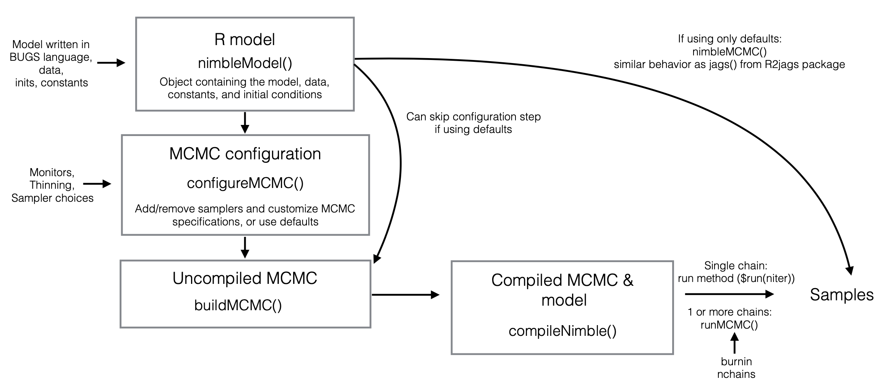

# NIMBLE tips and tricks
NIMBLE is an R package for statistical modelling. The software performs Bayesian inference through Monte Carlo Markov Chain (MCMC) sampling. The main advantages are speed –– NIMBLE runs iterations in C++ but all user code is written in R –– and flexibility –– with `nimbleFunction()` you can write custom distributions and functions.

This is a summary of the content I found useful from the __NIMBLE workshop__ (mostly for running MCMCs). Massive thanks to Chris Paciorek, Perry de Valpine and the rest of the NIMBLE team for holding the sessions. Please refer the materials from the [virtual NIMBLE workshop page](https://github.com/nimble-training/nimble-virtual-2020) (June 3-5 2020) or the [manual](https://r-nimble.org/html_manual/cha-welcome-nimble.html) for full examples –– all the content below (diagrams, code etc) is taken from there. The NIMBLE team have also released a [cheatsheet](https://r-nimble.org/cheatsheets/NimbleCheatSheet.pdf).

## How do MCMCs work?
The aim is to find the best parameters for a model (likelihood) using Bayes' theorem. MCMC is the gold standard for producing unbiased posterior estimates where analytical solutions are intractable. It does this by sampling directly from the posterior. Ideally, we would have independent samples, but this is not possible, so we use MCMC sampling to generate sequentially-dependent (hence, Markov chain) samples.

But how do the samplers work? Let's consider the samples as an array with elements &theta;<sub>i</sub><sup>(k)</sup> (i parameters for columns, k iterations for rows). An _MCMC kernel_ (colloquially, MCMC) comprises one or more samplers that define P(&theta;<sup>(k+1)</sup> | &theta;<sup>(k)</sup>) –– a way of updating all the parameters between iteration k and k+1. An MCMC is an __updater__.

This is represented in NIMBLE itself as a `nimbleMCMC()` object –– an _ordered set of samplers_. Hence, when we describe a _configuration_ we are talking about the sampler assignments (sampler type, target node, control parameters). The configuration is _the list of parts_ needed to assemble the MCMC machine. The samplers are ordered to update all &theta;<sup>(k)</sup> &rarr; &theta;<sup>(k+1)</sup> for the entire dimension of parameters i. Once iteration k is updated, the the MCMC begins iteration k+1.

## Workflow
The workflow for creating and updating an MCMC using NIMBLE is as follows:

1.  Wrap the BUGS code describing the model in `nimbleCode()` and put this into `nimbleModel()` to make a model object.
    - Use `compileNimble()` to convert the model from R into C++.
2.  Modify the list of samplers in the MCMC using `configureMCMC()`.
3.  Make the MCMC object from each sampler configuration part with `buildMCMC()`.
    - `compileNimble()` to covert the MCMC to C++.
4. Update the parameters with `runMCMC()`.

If you are comfortable with NIMBLE's default MCMC settings, steps 2-4 can be invoked in one line using `nimbleMCMC()`.

A more detailed version of the workflow is below.


### Constants and data
When building a model, we call `nimbleModel(code, constants, data, inits)` where the `code` is the BUGS syntax model, `inits` are initial values, and `constants` and `data` need to be distinguished:
- __Constants__ are needed to make sense of the model definition. For example, indices defining groupings are constants.

- __Data__ are values that can be changed without changing model structure.

Constants cannot be changed once the model is created, but data (and initial values) can be. NIMBLE will still work if you accidentally input constants as data, but it will introduce extra dependencies which slow things down. In a sense, by defining a constant as data node, you are saying all observations _could_ depend on that node, so the graph (unnecessarily) connects the observations with the node –– just in case you want to change its value in the future.

### Definition-time _if-then-else_
Say you wanted to run a load of models with the same basic structure but with a few different elements in each. As a simple example, consider one model with a covariate and one model without. Rather than building a new model each time, we can use an conditional statement within the model definition.
```R
code <- nimbleCode({
    # Priors
    ...
    # Likelihood
    for(i in 1:10) {
        if(includeCov) {
            y[i] ~ ... + x_cov[i]
        } else {
            y[i] ~ ...
        }
    }
})

includeCov <- FALSE
m1 <- nimbleModel(code)
includeCov <- TRUE
m2 <- nimbleModel(code)
```
Model `m1` will run without the covariate, model `m2` will run with the covariate.

## Samplers and mixing
Even though MCMC samples are sequentially-dependent, the aim is always to make samples as independent as possible –– this is known as "mixing". We can thin (take every nth sample), but this isn't advised as there's always information in the samples. We can judge mixing by looking at the trace plots of the MCMC iterations for each parameter and calculating the Effective Sample Size (ESS). But sometimes, mixing is just poor.

Where conjugate samplers are not available, there are two main types of sampler in MCMC software. The NIMBLE default is the adaptaive Random Walk Metropolis Hastings (RW MH) sampler. Here, a normal (hence, random walk) proposal distribution is centred at a new value, and we decide whether to accept or reject based on the current value in the target (posterior) distribution. There is also the slice sampler, in which you pick a random height between the current value and the axis, and take a slice under the target distribution and drawn uniformly from the slice. Note that by the time the MCMC gets round to the next iteration after updating all the other parameters, the target distribution might be completely different. Generally, mixing is better for the slice sampler, but this comes at a high computational cost.

One strategy to improve mixing is centering covariates, reducing the dependence of the intercept on the slope. Centering the distributions of random effects by using an intercept of one distribution as the mean of another distribution is also beneficial.

For highly correlated parameters (trace plots go up and down at the same time), we can improve mixing using block samplers to update the parameters at the same time. In NIMBLE, we can change the MCMC configuration as `mcmcConf$addSampler(target = c(CorrelatingParams), type = "RW_block", ...)` to include a block sampler.

## Customisation
### Distributions
We can use `nimbleFunction()` to define probability density distributions beyond what is available by default (see [cheatsheet](https://r-nimble.org/cheatsheets/NimbleCheatSheet.pdf)). These density distributions can be used directly in the model code. An example is below:
```R
dcustom <- nimbleFunction(
  run = function(x = double(0), ..., log = logical(0, default = 0)) {
      returnType(double(0))
      ...
      if(log) 
        return(log(dens)) else return(dens)
  })
```
The input to the wrapper is an R function called `run` whose first argument is the density, `x`. For C++ to compile, it is necessary to define the dimensions of the input and output: `double(0)` for scalar; `double(1)` for vector; `double(2)` for matrix etc.

We can similarly create an `rcustom` function if we need to simulate from a distribution. In this case, the first argument of the R function is `n`, the number of sample values.

### Functions
We can also use `nimbleFunction()` to write a function in R that compiles in C++. We are limited to basic maths, distributions, _for_ loops, _if-then-else_ logic, linear algebra and R's `optim` function.

### Samplers
Building samplers requires a two stage evaluation: `setup` the MCMC configuration object (`mcmcConf()`); convert this into an MCMC sampler object (`buildMCMC()`) that we can `run`.

Below is a skeleton example of a Metropolis-Hastings (MH) sampler. We can customise by changing how we select a proposal value.
```R
customMH <- nimbleFunction(
  name = "customMH",
  contains = sampler_BASE, # for class inheritance
  setup = function(model, mvSaved, target, control) {
    scale <- if(!is.null(control$scale)) control$scale else 1
    calcNodes <- model$getDependencies(target)
  },
  run = function() {
    currentValue <- model[[target]]
    currentLogProb <- model$getLogProb(calcNodes)
    proposalValue <- ...
    model[[target]] <<- proposalValue
    proposalLogProb <- model$calculate(calcNodes)
    logAcceptanceRatio <- model$calculateDiff(calcNodes)
    accept <- decide(logMHR)
    if(accept) # accept: synchronize model -> mvSaved
      copy(from = model, to = mvSaved, row = 1, nodes = calcNodes, logProb = TRUE)
    else # reject: synchronize mvSaved -> model
      copy(from = mvSaved, to = model, row = 1, nodes = calcNodes, logProb = TRUE)
  },
  methods = list(
    reset = function() {}
  )
)
```
`setup` needs the following arguments:
- `model` is the model.
- `mvSaved` is a `modelValues` object for keeping a set of saved model states –– think of it as a row &theta;<sup>(k)</sup> in the MCMC samples matrix.
- `target` is a vector of target node names.
- `control` is a list of whatever sampler-specific configuration settings are needed.

The key is to have `mvSaved` and the `model` synchronised (have the same `modelValues`) at the beginning and end of `run()` the MCMC.

You can add custom sampler like this:
```R
mcmcConf$addSampler(target = c("monitorsUsingSampler"),
                    type = customMH,
                    control = list(...))
```

## Spatial models
Consider three approaches for dealing with spatial data:
- Conditional Autoregressive (CAR) for data aggregated to some spatial unit.
- Gaussian process (GP) regression, usually for point locations but can be used on the centroids of spatial units for aggregated data.
- Spline, same use cases as GPs.

Dealing with spatial data using MCMCs is tricky as parameters in space (and time) are usually highly correlated. Hence, MCMC mixing is often poor. Ususally, the only workaround is to run the models for a lot of iterations. To avoid long burn in times, it is essential to choose good initial values. We can do this by doing an _ad hoc_ fitting and assigning the initial values to the model as `inits = list(x = xInits)` or `inits$x <- xInits`.

### Conditional Autoregressive models
CAR models make use of the neighbourhood structure. Information is shared between neighbouring spatial units (without factoring for the size of the spatial units). So each CAR effect is centred around the mean of its neighbours' and with variance inversely proportional to the number of neighbours. It is written in the model code as a vectorised node of spatial effects `x` of length N locations.
```R
x[1:N] ~ dcar_normal(adj[1:L], weights[1:L], num[1:N], tau)
```
where `adj[1:L]`, `weights[1:L]` and `num[1:L]` form the sparse representation of the adjacency matrix, and `tau` is the precision.

### Gaussian processes
Unlike CAR models, spatial GPs rely on geographical distance rather than neighbourhood structure to produce an underlying surface.

We can use a `nimbleFunction()` to write the kernel (covariance) function between pairs of coordinates (if done in space, although can be extended to space-time or any other required dimension) typically governed by length scale, `l`, and amplitude parameter, `sigma`, which we want to optimise.
```R
kernel <- nimbleFunction(     
  run = function(dists = double(2), l = double(0), sigma = double(0)) {
    returnType(double(2))
    n <- dim(dists)[1]
    cov <- matrix(nrow = n, ncol = n, init = FALSE)
    sigma2 <- sigma*sigma   # calculate once
    for(i in 1:n)
      for(j in 1:n)
        cov[i, j] <- sigma2 * ...
    return(cov)
  })
```
Here, `dists` is matrix of distances between each pair of coordinates (constant to the model). This is often useful because kernel functions show correlation between points in space, which we assume is greater when things are closer together.

We can implement GPs in the model code as a vectorised node to calculate the spatial effects `x`.
```R
mu[1:N] <- mu0*ones[1:N] # prior mean
cov[1:N, 1:N] <- kernel(dists[1:N, 1:N], l, sigma)
x[1:N] ~ dmnorm(mu[1:N], cov = cov[1:N, 1:N])
```
This is a fully Bayesian approach as we are setting priors on the GP hyperparameters rather than maximising the likelihood of the data.

For large spatial models and spatial nonstationarity, the BayesNSGP package is useful and uses NIMBLE for inference.

### Splines
The mgcv package fits smooth spatial, temporal, spatio-temporal, and regression relationships using a penalised likelihood applied to the spline basis coefficients.

We can take the spline basis matrix and penalty matrix = prior precision matrix from mgcv and use it in a model in NIMBLE.

First, fit a `gam` (model that is a sum of smooth covariates) to the data to get the spline basis information.
```R
out <- mgcv::gam(y ~ ... + s(locations, k = K) ..., family = "...") 
```
where the `s` function is needed to set up splines at N locations (need to assign `K` as the minimum number of basis functions, K). From the output we can extract basis matrix `B` (dimensions N x K), and precision matrices `Q1`, `Q2` (each dimension K x K).

We then embed `B`, `Q1` and `Q2` in the NIMBLE model to work out the spatial effects `x`.
```R
# latent process is product of (known) spline basis and (unknown) coefficients
prec[1:K, 1:K] <- lambda[1] * Q1[1:K, 1:K] + lambda[2] * Q2[1:K, 1:K]
beta_x[1:K] ~ dmnorm(zeros[1:K], prec[1:K, 1:K])
x[1:N] <-  (B[1:N, 1:K] %*% beta_x[1:K])[,1]
```
Splines typically work best for smooth latent surfaces where few basis functions are required and we can really reduce the parameter space.

### Comparing models with WAIC
NIMBLE has inbuilt capacity to calculate WAIC values to compare model fits. It can be implemented as `WAIC = TRUE` in `nimbleMCMC()`. Lower WAIC, better model.

WAIC relies on being able to partition the data. It is not clear how this works on spatial or temporally-correlated data.
